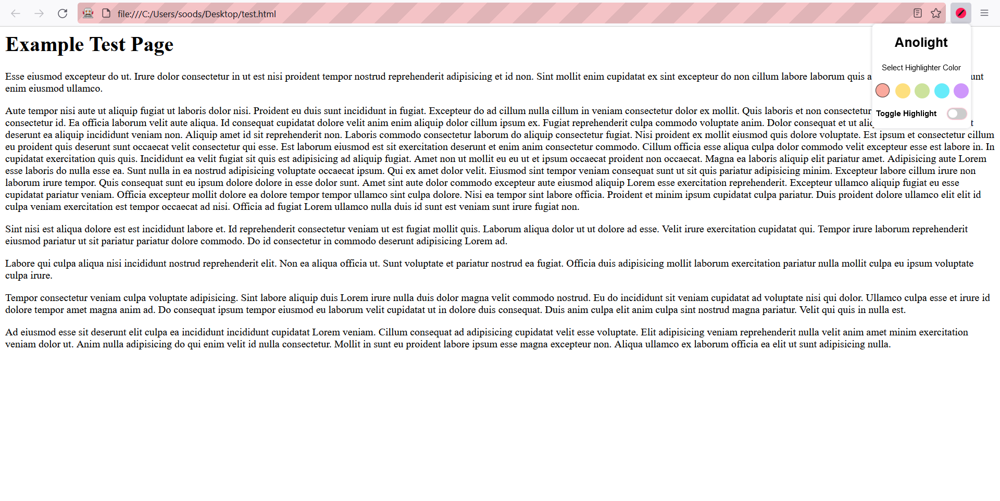
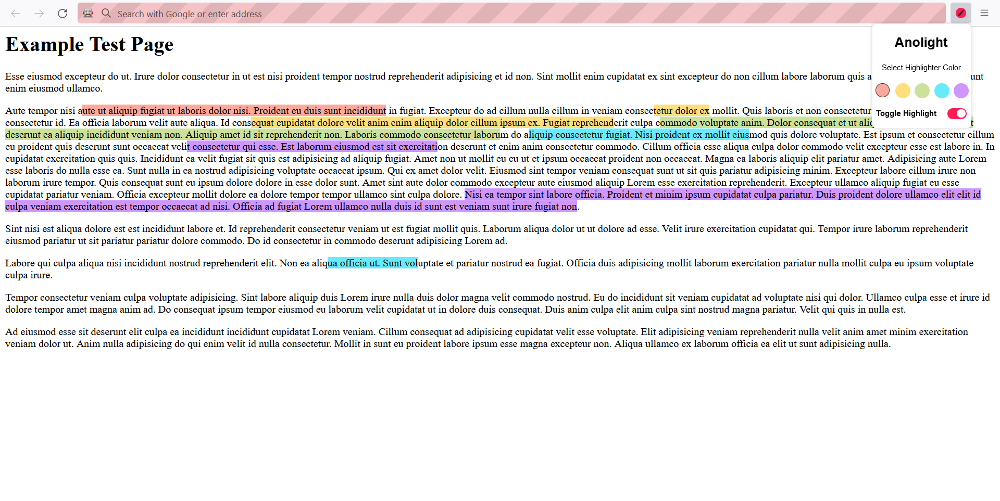
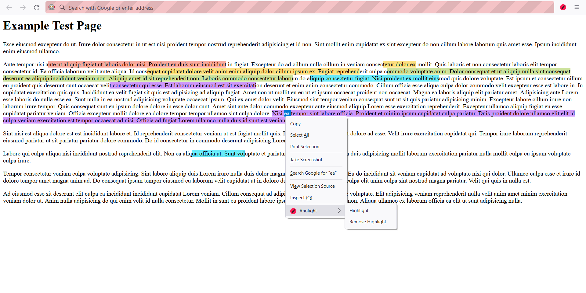

<h1 align="center">
  <br>
     
  <br>
  Anolight - Web Highlighter
  <br>
</h1>


<p align="center">
     
     
     
     
</p>


Anolight is a web extension built for Firefox using React and TypeScript. It adds highlighting functionality to the default Firefox browser, allowing users to quickly mark text on the web. 

### ⚡Installation

Download the Anolight web extension directly from the [Firefox addon store](https://addons.mozilla.org/en-CA/firefox/addon/anolight/) or build a local copy by cloning the repository and running ```npm run build``` (output files are located in the build folder). The extensions can then be loaded into Firefox by navigating to the ```about:debugging``` page or by using the [web-ext](https://extensionworkshop.com/documentation/develop/getting-started-with-web-ext/) command line tool. 

### 📷 Extension Images




### 📄 License
Anolight is licensed under the MIT open source license